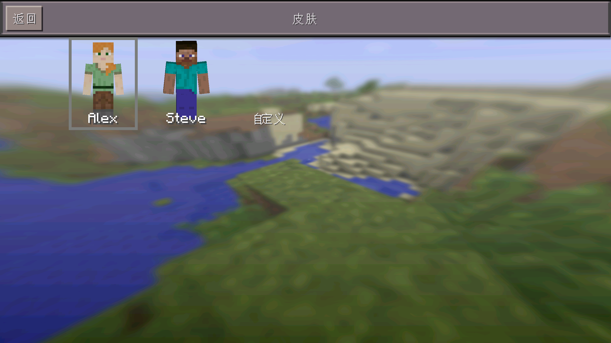

# SkinPrune

SkinPrune 是针对 **Minecraft PE 0.14.3** 的皮肤包精简方案

通过删去游戏里附带的皮肤包以精简安装包体积大小

皮肤包的 PNG 依赖改为 Steve/Alex 皮肤并保留皮肤 ID, 模型 JSON 与联机模型映射



## 用 Python 修补 SO

安装 Python 3, 在脚本目录运行:

```
python patch.py libminecraftpe.so
```

仅接受名为 `libminecraftpe.so` 的文件

运行后自动在输入 SO 所在目录生成以 SkinPrune 开头的 SO 文件

## 在 IDA Pro 中修补

用 IDA 打开 SO 副本, image base 保持 0

选择 File -> Script file… 运行 `ida_patch_all.py`, `patch.py` 须与它在同一目录

脚本会检查 ELF 映射和 176 处补丁位点, 然后修改 IDA 数据库

检查 Patched bytes 列表 (可以按 `Ctrl+Alt+P` 快捷键打开), 再切换回IDA视图, 点 Edit -> Patch program -> Apply patches to input file… 写回 SO
